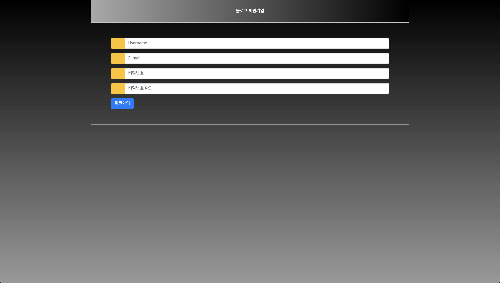
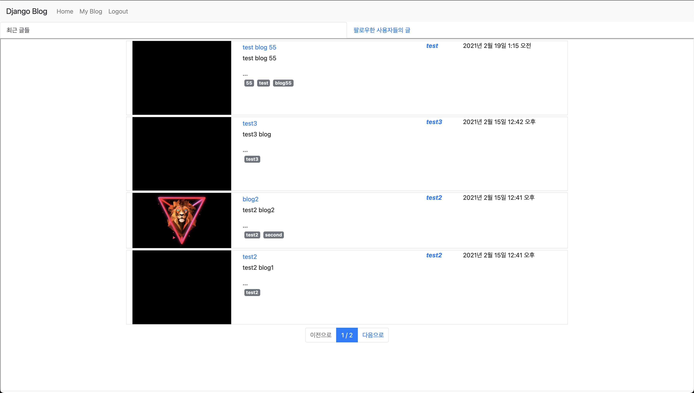
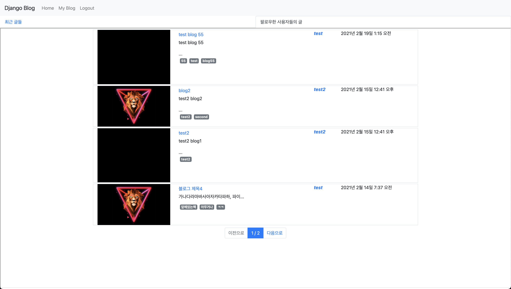
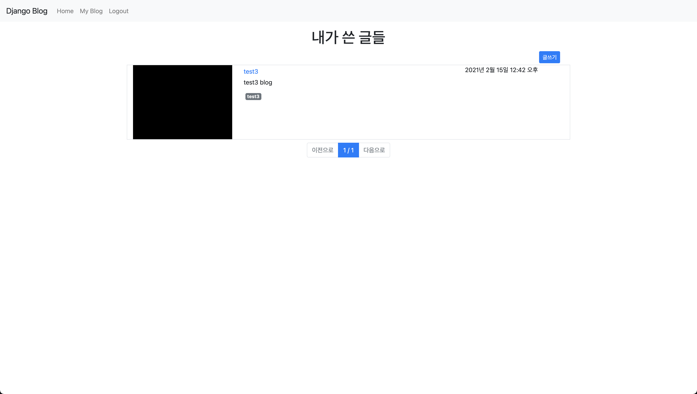
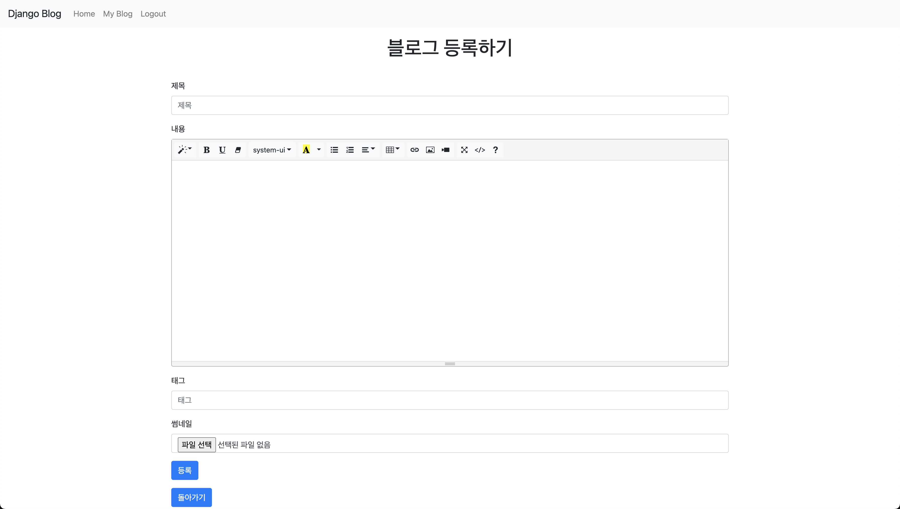
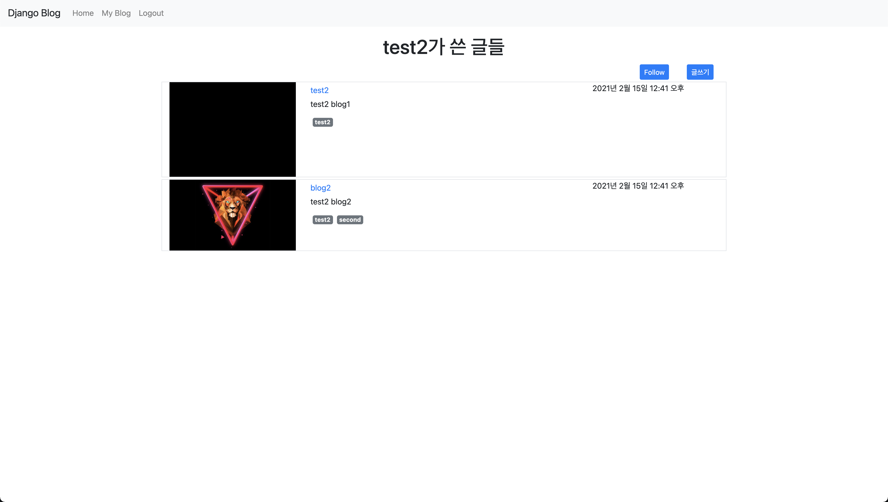
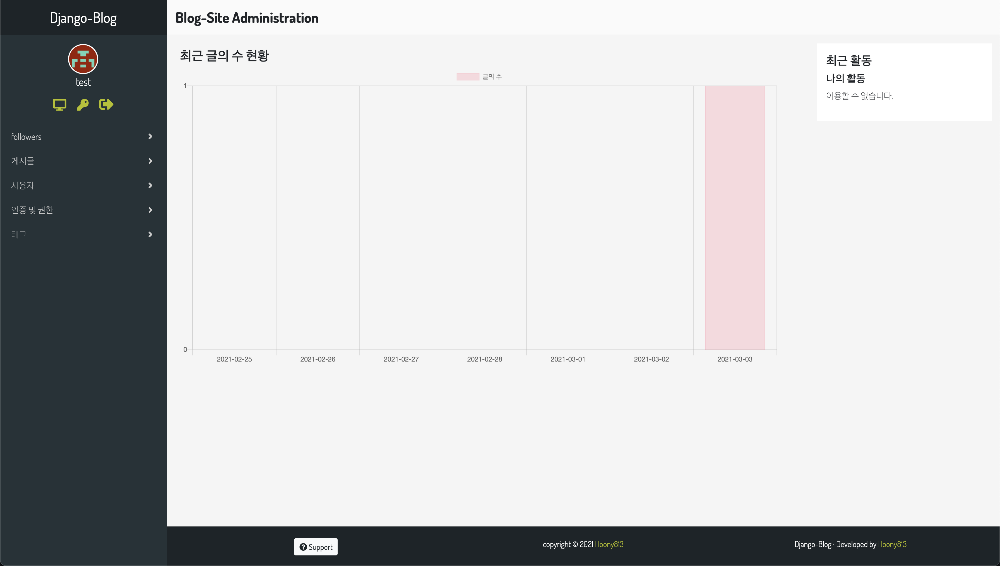

# django_blog
## Django를 이용한 팔로우,태그와 썸네일 기능이 있는 블로그

* 로그인 화면

* 회원가입화면

* 홈화면
  - 최근 글들
  - 
  - 팔로우한 유저들의 글
  - 

* 내 블로그 화면

* 블로그 등록

* 팔로우 하지 않은 유저의 블로그

* 팔로우한 유저의 블로그

* 관리자 페이지 (admin 페이지)
 - Baton 테마를 적용한 관리자 페이지
 - 
